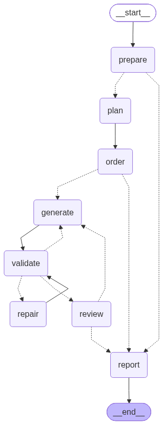

# spec-to-app-agent

A command-line agent that reads a product specification written in plain
English and generates a working React 19 + TypeScript application into the
provided boilerplate — planning the work, generating file by file, validating
its own output with the type checker and the test suite, and repairing its own
failures.

---

## Quick start

**Node 22.18 or newer is required** — `package.json` declares it under
`engines`. `npm start` runs `agent/src/cli.ts` directly, relying on Node's
native TypeScript type stripping; there is no build step and no loader. On a
runtime without it, the very first command below fails on a file it cannot
execute, before anything about the agent is reached.

```bash
# 0. Check the runtime
node --version          # must be >= 22.18

# 1. Install the agent's dependencies
npm install

# 2. Provide a key for the provider you want to use
cp .env.example .env    # then fill in one key

# 3. Generate an application into a directory that does not exist yet
npm start -- --spec ./specs/smoke.md --output ./out/smoke

# 4. Run what it produced
cd out/smoke && npm run dev
```

### Which specification to run

Step 3 starts with the cheap one on purpose: it exercises the whole loop —
plan, order, generate, validate, repair, review, report — for about two minutes
and thirty cents, which is enough to know the agent works with your key before
committing four dollars to it.

| Spec | What it is for | Tasks · calls | Cost | Wall clock |
|---|---|---|---|---|
| `specs/smoke.md` | One page, one list, one test. The end-to-end check. | 5 · 8 | $0.3081 | 2 min |
| `specs/car-inventory.md` | The full application, and the run that produced `generated-app/`. | 17 · 25 | $4.2584 | 32 min |
| `specs/variant.md` | A different domain and different requirements — the generalization test. | 18 · 21 | $1.9440 | 13 min |

Every figure is measured, not estimated. Cost and counts are the headline line
of each run's `summary.md`; the two lower rows are committed under
`agent/runs/`, and the smoke row is from the clean-clone run this README's setup
steps were verified with, whose artifacts are not committed. Wall clock is not a
field the agent records — it is the gap between the run id, which is the start
timestamp, and when `report` wrote the summary. Your own runs will differ:
these models are not deterministic, and two runs of the same specification here
have already produced different plans.

**`--output` must name a fresh directory.** `prepare` copies the boilerplate
over the destination and does not clean it first, so pointing it at a directory
that already holds an application mixes the new run into the old one: the
previous files stay on disk, the surface manifest reports them, and the type
checker compiles them. In particular, do not point it at `generated-app/` —
that is a committed run's output, not a destination.

To look at a finished application without spending anything:

```bash
cd generated-app && npm install && npm run dev
```

### The CLI

```
Usage: npm start -- --spec <path> --output <dir> [options]
```

| Flag | Meaning |
|---|---|
| `--spec <path>` | Specification file to build from. Required. |
| `--output <dir>` | Directory the application is generated into. Required, and should not exist yet. |
| `--provider <name>` | `anthropic`, `openai`, `gemini` or `openrouter`. Defaults to `$LLM_PROVIDER`, then `anthropic`. |
| `--model <id>` | Model id, overriding the default for every role. |
| `--cache <mode>` | Prompt cache on the stable prefix: `on` or `off`. Defaults to `on`; `off` prices a run that caches nothing. |
| `--help` | Print the usage message. |

`gemini` and `openrouter` are reached through the OpenAI-compatible endpoint and
ship no default model, because none has been exercised here — name one with
`--model` or a `PLANNER_MODEL` / `CODER_MODEL` / `REVIEWER_MODEL` variable. Each
provider needs its own credential, and the agent reads only the one belonging to
the provider it was asked for; a missing key stops the run before the first
token is spent, naming the exact variable to define.

---

## What is in this repository

| Path | What it is |
|---|---|
| `agent/` | The CLI. The deliverable. |
| `boilerplate/` | The provided project, vendored. The agent copies it per run. |
| `generated-app/` | The output of an earlier run, committed so it can be read and run without an API key. Not an output directory to point a new run at. |
| `specs/` | The specifications the agent consumes. |
| `agent/runs/` | Artifacts from committed runs: plan, tool trace, errors, token ledger, summary. |
| `docs/ARCHITECTURE.md` | The design, node by node, and the decisions behind it. |
| `docs/provider-comparison.md` | The same specification run on two providers, with the ledgers. |
| `docs/generalization.md` | The agent run against a second specification in another domain. |
| `docs/process.md` | How the work was carried out, with one of the prompts that drove it. |
| `TICKETS.md` | How the work was broken down. |

---

## Architecture

The image below is written by `npm run graph:png`, which renders the *compiled*
graph through `getGraphAsync().drawMermaidPng()`. It is a picture of the edge
list the library will actually traverse, not of an intention — change the graph
and the regenerated image changes with it.

That costs two things. The image is a binary, so a reviewer cannot diff it. And
the script does not render locally: it base64-encodes the graph into a
`https://mermaid.ink/img/…` URL and downloads the result, so regenerating the
diagram needs a network call to a third party, carrying the node names and the
edge list. `npm run graph:mermaid` is the answer to both — it prints the same
graph as text, which is what shows an edge change in review, and it prints it
without leaving the machine.



Solid arrows are unconditional edges; the nine dotted ones are conditional, and
each is decided by a pure function of state. Which nodes call a model is not
something a generated diagram can express, so it is written down beside it
instead.

**Four of the eight nodes never call a model:** `prepare`, `order`, `validate`
and `report`. That is the shape of the whole design — the model supplies
semantics, this code supplies guarantees.

| Node | Model | What it does |
|---|---|---|
| `prepare` | none | Copies the boilerplate into the output directory, removes the two reference files it ships as examples, runs `npm install`, and parses `src/**` into a surface manifest: for each file, its exports and their signatures. This is what makes the agent read the provided project instead of assuming its shape. |
| `plan` | planner | Turns the specification and the project's signatures into a list of tasks — id, description, target path, task type, dependencies, acceptance criteria — with the shape enforced by a JSON schema rather than requested in prose. The only call in a run that decides *what* gets built. |
| `order` | none | Kahn's algorithm over the `dependsOn` edges, with cycle and dangling-reference detection, ties broken by task id. Ordering is a guarantee, so it is computed rather than asked for. |
| `generate` | coder | One task per visit. Its prompt is a stable, cacheable prefix — rules pack, a form-only example in an unrelated domain, the specification, the project's original surface — followed by the packs for this task's type and the task itself with the signatures its direct dependencies produced. Files are written through a sandbox that rejects any path outside the output directory. |
| `validate` | none | Runs the type checker every visit and the test suite when the task wrote a file the runner collects or when the queue is empty. Raw output is parsed into `{ file, line, code, message, source }`. It also settles the task it judged, and rolls the workspace back when a task runs out of repairs. |
| `repair` | coder | The one node that is handed a whole file body, and only ever the single file the task in flight owns. It receives the structured errors, not the raw compiler dump. The repair *is* the retry; how many a task gets is the edge's decision. |
| `review` | reviewer | A second model, by default a different one from the coder, compares the original specification against the finished surface and reports the requirements it believes are unmet. It reads signatures, not code: the question is coverage, not style. Gaps become remediation tasks. |
| `report` | none | Writes `errors.jsonl`, `usage.json` and `summary.md`, completing the five artifacts of a run, and computes the verdict the CLI turns into an exit code. |

Full contracts — what each node reads, writes and does on failure, the routers
written out as pseudocode, and the shared state field by field — are in
`docs/ARCHITECTURE.md`.

---

## Which models, and why

Three roles, and each provider assigns its stronger model to two of them:

| Role | Anthropic | OpenAI |
|---|---|---|
| planner | `claude-opus-5` | `gpt-5.6-sol` |
| coder | `claude-opus-5` | `gpt-5.6-sol` |
| reviewer | `claude-sonnet-5` | `gpt-5.6-terra` |

**The reviewer is deliberately not the model that wrote the code.** A model
asked to check its own output re-applies the assumptions that produced the gap
in the first place. It is also the cheapest place in the run to spend less: the
reviewer reads the finished surface and answers a schema-enforced question about
coverage, writing no code. Its two calls cost $0.0453 and $0.0108 in the two
comparison runs — under 1.5% of either bill — so coder-grade money there would
buy nothing the run can use.

Every default is overridable per role with `--model` or a `*_MODEL` variable,
which is how the same graph reaches a provider that ships no defaults at all.

### The same specification, on both providers

Both runs are from commit `d638b13`, with only `--provider` and `--output`
changed. Full ledgers, the failure analysis for each, and what the cache column
does and does not mean: `docs/provider-comparison.md`.

| Provider | Models | In / out tokens | Cached reads | Cost | Tasks done / failed | Repair cycles | App green? |
|---|---|---|---|---|---|---|---|
| Anthropic | `claude-opus-5` · `claude-sonnet-5` | 40,553 / 132,841 | 97,340 | **$3.5727** | 15 / 2 | 2 | typecheck, build and tests exit 0 — but one required test file is missing, so the run exits 1 |
| OpenAI | `gpt-5.6-sol` · `gpt-5.6-terra` | 85,662 / 38,601 | 0 | **$1.5701** | 10 / 1 | 8 | typecheck, build and tests exit 0; every requirement covered; exit 0 |

On this pair of runs OpenAI came out cheaper and more complete. The gap is
volume, not price: `gpt-5.6-sol` costs more per output token ($30/M against $25)
and still cost less than half as much, because it emitted 38,601 output tokens
against 132,841. This is one run per provider, on non-deterministic models that
have already produced different plans for the same specification in this
project. It shows the abstraction works and prices both; it does not establish
which provider is better.

The cached-reads column is not a finding about either provider. The cache
breakpoint is placed only by the native adapter, so the OpenAI run was never
asked to cache anything — `docs/provider-comparison.md` says what measuring it
properly would take.

---

## Cost per run

Figures below are from the run that produced `generated-app/` — run id
`2026-08-14T20-57-19-479Z`, artifacts in `agent/runs/`. It is a different run
from the Anthropic row of the table above, which is `2026-08-14T22-54-34-766Z`.

**17 tasks · 25 model calls · $4.2584.**

|  | tokens | cost | share |
| --- | --- | --- | --- |
| input, uncached | 49,816 | $0.2286 | 5.4% |
| input, cache read | 102,207 | $0.0511 | 1.2% |
| input, cache write | 4,867 | $0.0304 | 0.7% |
| output | 158,670 | $3.9483 | 92.7% |

**Output is 92.7% of the bill and all input together is 7.3%.** That ratio is
not particular to this run: output is 92.7% of the Anthropic comparison run too,
and 88.8% of the second-specification run. It is 73.5% in the OpenAI run, whose
input share of 26.5% is high precisely because no cache breakpoint is placed
there — that is what the split looks like when nothing is cached.

**What the prompt cache actually saves.** The stable prefix is
re-read on every task: the per-task table in `summary.md` shows 4,867 cached-read
tokens on every task that made one call and 9,734 on the ones that also repaired
— the same prefix, every time. Priced at full input rates, those 102,207 cached
reads plus the 4,867 written would have cost $0.7640 instead of $0.3101, a 59.4%
saving on the input bill. In whole-run terms: **without the cache this run would
have cost $4.7123; it cost $4.2584.**

So the cache works and its effect is small, because it can only ever act on the
7.3% of the bill that is input. Anything that moves the output column moves the
cost. That is why the ceiling described in *What I would improve* matters more
than another caching optimisation would.

**Context stays bounded, and the ledger is the evidence.** Nothing downstream of
`prepare` receives a generated file's body except `repair`, and only for the one
file that failed; what travels instead is signatures. Two figures from the
twenty `generate` calls of that run say so.

The cached prefix is **4,867 tokens on all twenty** — written once on the first
call, read back unchanged on the other nineteen. That is the part that is
genuinely flat, and it is flat exactly, not approximately.

The uncached part is not flat, and it should not be: it carries the task and the
signatures of what its dependencies produced, so it scales with how many
dependencies a task has, not with how late it runs. In order, those twenty calls
cost 541, 553, 479, 812, 1376, 491, 968, 617, 581, 2172, 799, 1493, 1529, 1475,
1488, 1494, 1530, 3754, 3790 and 3835 tokens.

**The number to read is the largest, not the smallest.** The three biggest calls
are the run's two remediation tasks, and they are the widest prompts the agent
can produce: `review.ts` gives a remediation `dependsOn` naming *every task that
finished*, deliberately, because the reviewer knows which file is missing and
has no way to know which edges lead into it. Thirteen tasks had finished, so
those calls carried thirteen files' signatures and the reviewer's gap text, and
cost 3,835 tokens. The widest task in the plan itself, `inventory-page` with six
dependencies, cost 2,172.

That ceiling is the evidence. A generated file's body is thousands of tokens on
its own, so a prompt carrying thirteen of them would have cost tens of thousands
— an order of magnitude more than 3,835. Signatures are what the difference is
made of, and the ledger is where it can be checked.

Reproduce any of this from the ledgers with `agent/src/llm/pricing.ts`; the
per-role, per-node and per-task breakdowns are in each run's `summary.md`.

---

## Design decisions and tradeoffs

Every row names the axis it wins on and what it costs. A decision with no cost
is a decision that was not examined. The full table, with the alternatives
spelled out, is `docs/ARCHITECTURE.md` §5.

| Decision | Wins on | What it costs |
|---|---|---|
| **LangGraph for orchestration**, rather than a `while` loop over a queue | Legibility from outside: nodes and edges read without tracing control flow, and the diagram above is rendered from the compiled graph, so it cannot describe an architecture the code does not have. | Roughly fifty transitive dependencies. A hand-written loop would have been faster to write and lower-risk on a machine that is not this one; it wins on weight, speed and risk. |
| **LangChain confined to three jobs** — provider selection, schema-validated output, token usage | Keeping decomposition and control flow visible. A prebuilt ReAct agent would move exactly the parts being assessed into the framework. | Loop code written by hand that a prebuilt agent would have supplied. The intended cost, not a side effect. |
| **No checkpointer** | Install risk. `MemorySaver` would survive only as long as the single `stream()` call a run already is; the SQLite one pulls in a native module compiled against Node's ABI. | Resume across process restarts. An interrupted run starts over and pays for every call again. |
| **The provider's prompt cache is the only cache** | Honesty of the artifacts: no cache files in the repository, no stale entry masking a prompt change, and `--cache off` makes the saving measurable against a run without it rather than asserted. | Re-running costs a full run. Nothing here makes a second execution of the same specification cheaper than the first. |
| **Execution order computed in code** | Reproducibility and safety: Kahn's algorithm cannot return a cyclic order, and a model cannot promise that. | Nothing functional. The model still decides the dependency edges, which is the semantic part. |
| **Signatures between tasks, never file bodies** | Flat per-task prompt size, and a claim checkable against the ledger. | The model cannot see its dependencies' implementations. If a task genuinely needs one, the interface is wrong. |
| **Knowledge packs selected by task type** | Targeted context, and a durable home for a lesson: a repeated failure is fixed in the pack, where it benefits every future task of that type. | More files, and a task type the planner invents falls back to rules-only — deliberately, since failing because a specification asked for something outside a catalogue is the failure mode this design exists to avoid. |
| **Type checker every visit, test suite conditionally** | Speed: the slow signal runs only when a test file changed. | A regression introduced by a non-test task surfaces later in the queue rather than immediately. The final task always runs both. |
| **Structured output via `method: "jsonSchema"`** | One code path across both providers for the guarantee the plan depends on. | `strict` is honoured by one provider only, so that one flag still branches. |
| **Two providers, both exercised and published** | Evidence over assertion: the same build drives both, and the ledger prices both. | A second adapter to keep working, and a comparison that could produce — and did produce — an unflattering cell. |
| **Config changes to the boilerplate in their own commits** | Reviewability: each change is a diff against the untouched import. | The vendored copy is no longer byte-identical to what was provided. |

---

## Generalization

`specs/variant.md` changes the domain and the requirements at once: a vinyl
record collection instead of a car inventory, a decade filter and a detail view
the primary specification never asks for, and no create form, which it does.
The agent was not edited for it — same commit, two arguments different.

**18 tasks planned, 18 done, 0 failed, 1 repair, 1 review round, $1.9440, exit
0.** Five test files, all written by the agent, all passing. No task carried a
name from the first domain, and no task was planned for the create form the
first specification wanted.

Two things that run did *not* prove, both written up in `docs/generalization.md`
rather than left out: the provided data layer was never rewritten, so the
coherence risk that document was written to look for could not arise; and the
new domain happened to map onto the mock API one field at a time, so a
field-for-field adapter at the hook boundary was enough. A specification whose
entities the mock cannot express would test something this one did not.

That no domain vocabulary reaches the prompts is enforced by a test, not by
inspection: `agent/src/__tests__/no-domain-vocabulary.test.ts` scans every file
under `agent/knowledge/` and `agent/src/prompts/` for the nouns of both
specifications and fails the build if one appears.

---

## What I would improve with more time

Four things, each with the measurement that identifies it.

**1. Execute each topological level in parallel.** Tasks in the same level are
independent by construction. In the second-specification run all five test tasks
sat in one level — 27.8% of the tasks and 59.4% of the output tokens — and ran
strictly one after another. Sequential execution was chosen on purpose: a linear
trace is what makes a run auditable and a failure attributable to one task. With
more time, levels run concurrently while the trace keeps that property.

**2. Detect a response that ran out of room.** `MAX_OUTPUT_TOKENS` is 16,000 in
`agent/src/llm/factory.ts`. In the Anthropic comparison run, four generation
attempts — the sort test twice, then its remediation twice — each spent exactly
16,000 output tokens and were cut off mid-answer, before the schema's required
`contents` field was complete. The agent cannot tell a model that was wrong from
a model that ran out of room, so it retried a question whose answer never fit,
and lost the requirement. The other three test tasks of that run reached 95%,
83% and 67% of the same ceiling, so this was the tail of a distribution the run
was already sitting in, not an outlier. A length finish reason is detectable and
would be actionable.

**3. Nothing watches the data layer for coherence.** `queries.ts` and
`handlers.ts` have to agree — an operation declared in one needs a handler in the
other — and no signal checks that. The generated tests mock above the network,
so an operation with no handler leaves the type check clean, the suite green and
the exit code at 0, and shows up only in the browser.

**4. The tool trace records absolute paths.** 37 of the 85 lines of the committed
`tools.jsonl` carry this machine's local path — 18 in `args`, 19 in `detail`.
Relativising them against the output directory where the entry is recorded is one
line, and it makes the artifact portable.

---

## What I deliberately did not build

The brief warns against an over-engineered framework, so this is the list of
things that were considered and left out. Each has its reasoning in the commit
that decided it.

- **A response cache on disk.** The evaluator supplies their own key, so a
  keyless replay is owed to nobody, and the committed artifacts are already free
  to read. A disk cache would buy cheaper development runs at the price of cache
  files in the repository and stale entries that mask a prompt change.
- **Parallel task execution.** See above: chosen against for the auditable
  linear trace, and the measurement that says what it would be worth is
  published anyway.
- **A checkpointer.** Nothing here resumes across a process restart, and the
  in-memory option would not have changed that.
- **Any dependency for the command line.** No argument parser, no colour, no
  spinner. `node:util`'s `parseArgs` and `console.log` cover it.
- **A generic web-app builder.** The stack is fixed by the boilerplate and the
  generable surface is `src/`. What generalizes here is the domain and the
  features, not the technology.

---

## Notes and assumptions

See `docs/ARCHITECTURE.md` → *Notes & Assumptions* for observations about the
provided material — including the two places the assessment PDF and the
repository README differ, the dependency advisories found on a clean install,
and the configuration inconsistency that made two validation signals disagree.

One is worth repeating here, because it explains an exit code a reader will see:
**the committed run reports two failed tasks and exits 1, and the application it
produced is complete anyway.** Both failures were remediated in the same run —
the reviewer found the gaps, queued two remediation tasks, and those wrote the
missing files green. The exit code reflected the run's history rather than its
outcome. That was one of three defects the run exposed; all three are fixed in
later commits, and the fix is visible in the second-specification run, which
exits 0.

---

## How I worked

I spent the first part of this exercise not writing code. I read the assessment
PDF and the boilerplate README against each other, found the places they
disagree, and wrote down which reading I would follow and why. Then I read the
boilerplate itself — every file, plus the lockfile — and ran it, because the
constraints that break generated code live in the configuration, not in the
prose. Only after that did I design the agent and break the work into the
tickets in `TICKETS.md`.

The tickets came before the code, deliberately. Each one names why it exists,
what it touches, and what has to be true for it to be finished. That upfront
pass is what let me work in small, ordered commits instead of discovering the
architecture while writing it — the git log is a record of the plan being
executed, not reconstructed afterwards.

I executed one ticket per session with a clean context, which forces each
ticket to be self-contained: if a session needed information that was not in
the repository, that was a defect in the ticket, not in the session. Each
ticket ended at an approval gate — I reviewed the work and staged it myself.
Every git operation in this repository was run by hand; no session ran a
command that changed history.

The final audit ran in a separate session with no memory of the work, because a
session that just wrote something is a poor judge of it. Where a technical
claim could be checked rather than argued, I checked it: the one prompt rule I
had reasoned my way into was disproved by writing both forms into a copy of the
boilerplate and running the type checker, so it never reached the agent's
prompts.

On authorship: the architecture, the decomposition into nodes, the decision
about what the model is allowed to decide, and the tradeoffs in
`docs/ARCHITECTURE.md` are mine. AI wrote code under my review, ticket by
ticket, against acceptance criteria I set, and each session had to state which
files it would touch and what each would expose before it was allowed to write
any of them. That is also the honest description of how the tool in this
repository is meant to be used — which is why it is built so that ordering,
validation, limits and cost are guaranteed by code, and only the semantics are
delegated to the model. `docs/process.md` describes the method and shows one of
the prompts that drove it.
