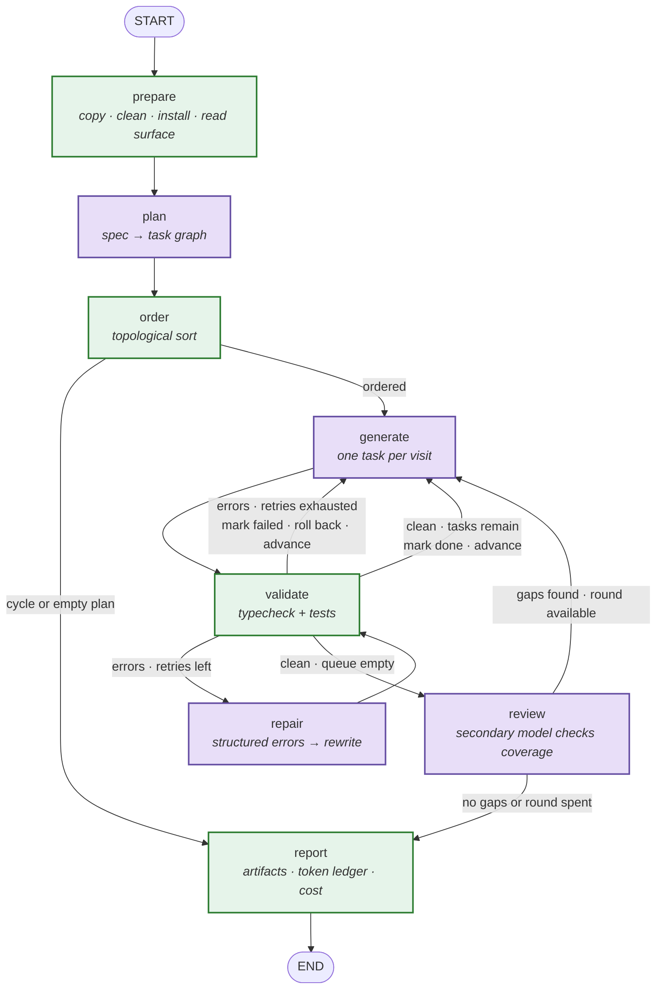

# Architecture

How the agent turns a natural-language specification into a working React 19 +
TypeScript application, and why it is built this way.

The short version: **the model supplies semantics, this code supplies
guarantees.** The model decides what to build and writes the code. Ordering,
validation, sandboxing, retry limits and cost accounting are plain TypeScript.
Every time a guarantee is handed to the model instead, the evidence of design
disappears with it.

---

## 1. The graph

> This diagram is drawn by hand for now. Once the graph exists in code it is
> replaced by the output of `npm run graph:mermaid`, which renders the compiled
> graph via `getGraphAsync().drawMermaid()`. A diagram generated from the code
> cannot drift away from it; a hand-drawn one can.



Green nodes are deterministic TypeScript. Purple nodes call a model. Three of
the eight nodes never talk to a model, and that is the point: `order`,
`validate` and `report` are the guarantees, and they are first-class boxes in
the diagram rather than helpers hidden inside another node.

### Why these eight

| Node | Why it is not folded into its neighbour |
|---|---|
| `prepare` | It reads the provided boilerplate from disk at runtime. That is what lets the agent discover the operations the project already exposes instead of assuming them from a prompt. |
| `plan` | The only call in a run that decides *what* gets built. |
| `order` | Kept separate so the diagram shows that execution order is computed, not requested from the model. Folding it into `plan` would hide the single clearest piece of evidence for task decomposition. |
| `generate` | One task per visit, so a failure is attributable to a task rather than to a batch. |
| `validate` | Two independent signals. Folding it into `generate` would make "the model says it is done" the completion criterion. |
| `repair` | The only node that receives a whole file body. Separating it keeps that exception visible. |
| `review` | The "secondary LLM call to review its own code" the brief asks for. It reads contracts, not code — its job is coverage against the spec, not style. |
| `report` | Produces the run artifacts and the cost figure, which are submission requirements. Also owns the process exit code. |

### The conditional edges

Three routers, each a pure function of state.

```
routeAfterOrder(s)
  s.tasks.length === 0 || cycleDetected  → "report"
  otherwise                              → "generate"

routeAfterValidate(s)
  s.errors.length > 0 && attempts[current] <  MAX_REPAIRS       → "repair"
  s.errors.length > 0 && attempts[current] >= MAX_REPAIRS       → "generate"   // fail, roll back, advance
  s.errors.length === 0 && cursor + 1 <  orderedTaskIds.length  → "generate"   // done, advance
  s.errors.length === 0 && cursor + 1 >= orderedTaskIds.length  → "review"

routeAfterReview(s)
  s.reviewReport.gaps.length > 0 && s.reviewRounds < MAX_REVIEW_ROUNDS → "generate"
  otherwise                                                            → "report"
```

`routeAfterValidate` carries the weight: it is simultaneously the repair loop,
the queue advance and the graceful-degradation path. It fits on one screen and
is unit-tested without an API key.

---

## 2. The nodes

### `prepare` — deterministic setup

- **Reads:** `outputDir`, `spec`
- **Writes:** `surface`, `log`
- **Model:** none

Copies `boilerplate/` into `outputDir` (excluding `node_modules/` and
`.DS_Store`), removes the two reference files the boilerplate ships as
examples, runs `npm install`, and then parses `src/**` to build the surface
manifest: for each file, its exports and their signatures.

The manifest is what makes the agent read the project instead of assuming it.
The provided boilerplate already exposes a single-item query and a create
mutation; an agent that learns this from disk reuses them, and an agent that
assumes the project's shape from a prompt writes duplicates that do not match
the mock handlers.

**On failure:** terminal. Routes straight to `report` with a setup-failed
verdict. Generating against a workspace that did not install is wasted spend.

### `plan` — spec to task graph

- **Reads:** `spec`, `surface`
- **Writes:** `tasks`, `usage`, `log`
- **Model:** planner role, structured output enforced against a schema

Receives the specification and the *signatures* of what the project already
exposes — never file bodies. Emits a list of tasks, each with an id, a
description, a target path, a task type, the ids it depends on, and its
acceptance criteria.

The task type is drawn from a fixed, domain-neutral vocabulary
(`component`, `hook`, `test`, `data-layer`, `styling`, `wiring`). It selects
which knowledge packs the generator loads. It is emitted by the model rather
than inferred from the file path, because path conventions are exactly the kind
of assumption that breaks when the specification changes shape.

**On failure:** one retry with the schema validation error appended to the
prompt. A second failure is terminal.

### `order` — execution order, computed

- **Reads:** `tasks`
- **Writes:** `orderedTaskIds`, `status`, `cursor`, `log`
- **Model:** none

Kahn's algorithm over the `dependsOn` edges. Detects cycles and references to
task ids that do not exist. Ties are broken by task id so that the same plan
always produces the same order.

**On failure:** does not throw. Writes the offending cycle to the log and lets
`routeAfterOrder` send the run to `report`, so a malformed plan produces a
diagnosable artifact rather than a stack trace.

### `generate` — one task at a time

- **Reads:** `tasks[cursor]`, `surface`, `spec`
- **Writes:** files on disk, `surface`, `usage`, `log`
- **Model:** coder role

The prompt is assembled as a stable prefix followed by the variable part, in
that order:

1. the boilerplate rules pack, always injected
2. the knowledge packs for this task's type
3. a form-only few-shot example in a domain unrelated to the specification
4. *(cache breakpoint here)*
5. the task itself, and the signatures of its **direct dependencies only**

Files are written through the sandboxed write tool, which resolves to an
absolute path and rejects anything outside `outputDir`. Before writing, the
node snapshots every file it is about to touch.

**On failure:** one retry with backoff on a transport or schema error. If it
still fails, the task is marked failed and the cursor advances.

### `validate` — two signals, never one

- **Reads:** `outputDir`, `tasks[cursor]`
- **Writes:** `errors`, `log`
- **Model:** none

Runs the type checker on every visit. Runs the test suite when the task touched
a test file or when it is the last task in the queue.

Both signals are required because they disagree by construction in this
project: a test file that relies on the runner's globals passes the test suite
and fails the type check. A validator that ran only the tests would hand over a
project that does not compile.

Raw output is parsed into `{ file, line, code, message, source }`. The parser
is unit-tested against captured output, so it is covered without an API key.

**On failure:** a command that fails to *start* is recorded as a synthetic
error with `source: "runner"` and flows down the same path. A validator that
dies quietly is worse than one that reports.

### `repair` — the only node that sees a file body

- **Reads:** `errors`, `tasks[cursor]`, the current contents of the failing file
- **Writes:** files on disk, `attempts`, `usage`, `log`
- **Model:** coder role

Receives the structured errors, not the raw compiler dump, plus the body of the
file that failed. This is the single place a whole file enters a prompt, and it
is scoped to one file.

**On failure:** increments `attempts` regardless of outcome. The ceiling is
enforced by the edge, not the node, so the retry policy lives in one place.

### `review` — coverage, not style

- **Reads:** `spec`, `surface`, `status`
- **Writes:** `reviewReport`, `reviewRounds`, `usage`, `log`
- **Model:** reviewer role, by default a different model from the coder

Compares the original specification against what was actually built and emits a
list of gaps, each naming the requirement it believes is unmet. It reads
signatures rather than code: its question is "is every stated requirement
represented", not "is this code tidy".

Using a different model from the one that wrote the code is deliberate. A model
reviewing its own output re-applies the assumptions that produced the gap.

**On failure:** records a null review and proceeds to `report`. A review that
errors must not sink an otherwise green run.

### `report` — artifacts and cost

- **Reads:** everything
- **Writes:** `agent/runs/<runId>/` on disk
- **Model:** none

Emits `plan.json`, `tools.jsonl`, `errors.jsonl`, `usage.json` and
`summary.md`. Sets the process exit code: 0 when every task is done, 1 when any
task ended failed.

**On failure:** I/O only; falls back to printing the summary on stdout.

---

## 3. The shared state

Every node reads and writes this one typed object. Only two fields accumulate.

| Field | Type | Notes |
|---|---|---|
| `runId` | `string` | Names `agent/runs/<runId>/`. Supplied at startup, not generated mid-graph, so a replay reproduces the same paths. |
| `spec` | `string` | The specification file's contents, verbatim. |
| `outputDir` | `string` | Absolute. The root of the write sandbox. |
| `surface` | `SurfaceManifest` | `Record<path, { exports: string[]; signatures: string[] }>`. Never file bodies. |
| `tasks` | `Task[]` | `{ id, description, targetPath, taskType, dependsOn[], acceptance[] }` |
| `orderedTaskIds` | `string[]` | Task ids in topological order, computed by `order`. |
| `cursor` | `number` | Index into `orderedTaskIds`. The task currently in flight. |
| `attempts` | `Record<string, number>` | Repair attempts consumed, per task id. |
| `status` | `Record<string, TaskStatus>` | `"pending" \| "done" \| "failed"` |
| `errors` | `BuildError[]` | `{ file, line, code, message, source: "tsc" \| "vitest" \| "runner" }` — the current validation result, overwritten each visit. |
| `reviewReport` | `ReviewReport \| null` | `{ gaps: Gap[]; verdict: string }`. Null until `review` runs. |
| `reviewRounds` | `number` | Review rounds consumed. Ceiling enforced by `routeAfterReview`. |
| `usage` | `UsageLedger` | **Accumulates.** One entry per model call: node, role, model, input tokens, cached-read tokens, cache-write tokens, output tokens, cost. |
| `log` | `LogEntry[]` | **Accumulates.** Append-only trace of tool invocations and routing decisions. |

Only `usage` and `log` use an accumulating reducer. Everything else overwrites,
which is the default. A state where every field accumulates is a state that
grows without bound and eventually costs more than the work it describes.

**A node is an action and a field is a datum: nodes are verbs, state is nouns.**
Three fields — `tasks`, `orderedTaskIds`, `reviewReport` — used to carry the
name of the node that produces them instead of a name of their own. The graph
library refuses a channel and a node that share a name, which is how the
mistake surfaced; it was a naming mistake either way.

---

## 4. Context between nodes

**Nothing downstream of `prepare` ever receives a generated file's body, except
`repair`, and only for the one file that failed.**

What travels instead is the **surface manifest**: for each file, the names it
exports and their signatures. A task that depends on two earlier tasks receives
the signatures of those two, and nothing else.

Three reasons, in order of weight:

1. **It is the only version that stays flat.** Passing bodies means every task
   costs more than the last, and by the seventh task most of the prompt is code
   the model does not need. Passing signatures means a task's prompt is sized by
   its own dependencies, not by how late in the run it happens to be.
2. **It is measurable, so the claim can be checked.** The token ledger records
   input tokens per task in execution order. If a late task costs roughly what
   an early one cost, context is bounded and the number proves it. If the curve
   climbs, the ledger contradicts the claim in public. The instrument that
   demonstrates the property is the same one that produces the cost figure.
3. **Signatures are what callers need.** A component consuming a data-access
   layer needs its shape, not its implementation. Sending the body invites the
   model to reason about internals it should not depend on.

The knowledge packs work the same way from the other direction: rather than one
large instruction block sent with every task, a small always-injected rules pack
plus the packs matching the task's type. A component task does not pay for the
testing conventions, and a test task does not pay for the layout conventions.

Because the always-injected part is byte-identical across every task in a run,
it is also the natural cache prefix — see section 6.

---

## 5. Decisions

Every row names the axis it wins on and what it costs. A decision with no cost
is a decision that was not examined.

| Decision | Rejected alternative | Why | What is lost |
|---|---|---|---|
| **LangGraph for orchestration** | A plain `while` loop over a queue | The graph is declarative: nodes and edges can be read without tracing control flow, and the README's diagram is **rendered from the compiled graph**, so it cannot describe an architecture the code does not have. | Roughly fifty transitive dependencies, and a hand-written loop would have been faster to write and lower-risk on the evaluator's machine. The plain loop wins on weight, speed and risk; it was rejected only because the decomposition is 30% of the score and needs to be legible from outside. |
| **LangChain limited to three things** — provider selection, schema-validated output, token usage | Prebuilt ReAct agents, memory, retrievers, vector stores, `.pipe()` chains | A prebuilt agent moves decomposition and control flow into the framework. Those are exactly the parts being assessed; delegating them removes the evidence of designing them. | Some of the loop is hand-written that a prebuilt agent would have supplied. That is the intended cost, not a side effect. |
| **`MemorySaver` as checkpointer** | `@langchain/langgraph-checkpoint-sqlite` | The SQLite checkpointer pulls in a native module that compiles against Node's ABI. The installed runtime is newer than what these libraries target, making it the most likely thing to fail on a machine that is not this one. | Resume across process restarts. Recovered in practice by the response cache, which makes a re-run nearly free. |
| **Response cache on disk, keyed by model + prompt + schema** | Re-running against the API each time | Makes the committed run reproducible at zero cost: the evaluator replays the exact run with `--cache read-only` without holding a key. Also the largest single lever on development spend. | Cache files in the repository, and a stale entry can mask a prompt change. Mitigated by keying on the prompt bytes, so any prompt edit misses by construction. |
| **Execution order computed in code** | Asking the model for an ordered list | Ordering is a guarantee, not a judgement. Kahn's algorithm cannot return a cyclic order, and a model cannot promise that. It also makes the order reproducible across runs of the same plan. | Nothing functional. The model still decides the dependency edges — the semantics — which is the part it is good at. |
| **Signatures between tasks, not file bodies** | Passing already-generated files | Keeps per-task prompt size flat and makes the claim checkable against the ledger. See section 4. | The model cannot see implementation details of its dependencies. If a task genuinely needs one, that is a signal the interface is wrong. |
| **Knowledge packs selected by task type** | One instruction block sent with every task | Turns context management from an assertion into a number: the ledger shows per-task input varying by task type. It also gives repeated repair failures a durable home — the fix goes in the pack, where it benefits every future task of that type, rather than in one task's prompt. | More files, and a task type the planner invents falls back to rules-only. The fallback is deliberate: an agent that fails because the specification asked for something outside its catalogue is the failure mode this design exists to avoid. |
| **Structured output via `method: "jsonSchema"`** | Provider-default tool calling | The same method name works on both providers, so the schema guarantee — the part the plan depends on — takes one code path instead of branching per provider. Fewer places for the two providers to diverge unnoticed. | `strict` is only honoured by one provider, so that flag still branches. One conditional instead of two. |
| **No sampling parameters sent** | `temperature: 0` for determinism | Current Claude models reject `temperature`, `top_p` and `top_k` outright; sending them fails the request. Determinism comes from schema enforcement, code-computed ordering and the response cache. | The dial that never guaranteed identical output anyway. On the runs that matter, the cache is a stronger reproducibility guarantee than any temperature setting. |
| **Prompt cache breakpoint placed by hand on the stable prefix** | The provider adapter's automatic top-level cache setting | The automatic setting places the breakpoint on the *last* cacheable block, which is designed for growing conversations. These are independent single-turn calls whose last block is the task — the part that changes every time. Automatic placement would write a new cache entry per task and never read one, paying the write premium for nothing. | Manual placement, which must be verified rather than assumed. Verification is an acceptance criterion: cached reads must be non-zero on the second task of a run. |
| **Type checker every visit, test suite conditionally** | Running both every visit | The test suite is the slow signal and only changes when a test file changes. The type checker is cheap and catches the majority of failures. | A regression introduced by a non-test task is caught at the end of the queue rather than immediately. The final task always runs both, so nothing ships unvalidated. |
| **Two providers, both exercised** | One provider | The brief says the evaluator supplies their own keys, and lists several providers. Running the same specification through two and publishing the measured result is the difference between claiming the abstraction works and showing it. It answers two submission requirements at once — which models, and what a run costs. | A second adapter to keep working, and a comparison run that could produce an unflattering cell. An unflattering cell with an explanation is more credible than two clean ones nobody can check. |
| **Config change applied to the vendored boilerplate in its own commit** | Applying it at runtime inside `prepare` | The brief explicitly permits config changes. Making it a commit means the change is reviewable as a diff against the untouched import, and `prepare` stays a copy step. | The vendored copy is no longer byte-identical to what was provided. Commit 0 preserves the original, so the divergence is one `git diff` away. |
| **Reference files deleted deterministically by the copy step** | Letting the model decide whether to remove them | Removing a component and forgetting its test breaks the suite on an import that no longer resolves, and the repair loop then spends its budget on a problem it did not cause. Verified that nothing imports either file. | One fewer decision for the model. A desirable side effect: every test in the generated application is one the agent wrote. |
| **TypeScript pinned below the current major for the agent** | The latest release | The current major is a reimplemented compiler; the orchestration library's published type definitions are built against the previous one. Debugging a new compiler against third-party types is not what this exercise is testing. | Newer compiler features. The vendored application keeps its own pinned version and is unaffected. |

---

## 6. Cost per run

Instrumented from the first ticket that makes a model call, not added at the
end. Every call records:

```
{ node, role, model, inputTokens, cachedReadTokens, cacheWriteTokens,
  outputTokens, costUsd }
```

The per-token rates live in one table keyed by model. Cached reads and cache
writes are priced separately from ordinary input, because the point of the
cache is that they are not the same price — treating them as one would hide the
saving the cache exists to produce.

`report` writes the ledger to `agent/runs/<runId>/usage.json` and a rollup into
`summary.md`: totals per role, totals per node, and the run total in USD.

Two things fall out of the same instrument:

- **The cost-per-run figure** the submission requires.
- **The context-management evidence.** Input tokens per task, in execution
  order, is the number that shows whether prompt size stays flat as the run
  progresses. It is published whichever way it comes out.

A cached read that stays at zero across consecutive tasks means something
variable entered the supposedly stable prefix. That is a defect, not a
tuning detail, and it is checked as an acceptance criterion rather than
observed later.

---

## Notes & Assumptions

Observations made while reading the provided material, and the assumptions
adopted where it was ambiguous. The brief invites reasonable assumptions,
documented.

### About the provided material

1. **The PDF assessment and the repository README describe the same challenge
   in two versions that differ in about a dozen places.** Where they conflict,
   this submission satisfies the union of both and adopts the stricter reading.
   The differences that changed a decision: the PDF marks four application
   features optional that the README lists as required (all seven are built);
   the README documents a `--spec` / `--output` invocation that the PDF does not
   specify (that signature is implemented, satisfying both); the README asks for
   an explicit retry loop that the PDF states only in its architecture table (it
   is implemented). The PDF's numbered lists restart at 4 and at 9, and its
   rubric lists an agent-code-quality criterion twice, which suggests it was
   condensed from the README. Neither observation changed the work.

2. **A clean install of the provided boilerplate reports six advisories**, one
   low, four high, one critical. All six are development-only dependencies —
   build tooling, dev server, test runner — and all six are resolved by
   `npm audit fix` without forcing. They are addressed in a dedicated commit
   placed *after* the untouched import, so the record shows they were found and
   decided rather than absorbed silently.

3. **The provided `vitest` configuration enables globals, but the TypeScript
   configuration does not declare the matching types.** A test file that relies
   on the globals therefore passes the test suite and fails the type check —
   two validation signals disagreeing by construction. Adding the type
   declaration is one line, is explicitly permitted by the brief, and removes
   the entire class of failure. It is applied in its own commit.

4. **Property access on the mock resolver's variables was checked empirically
   rather than assumed.** The provided handlers use bracket access
   (`variables["id"]`). Both forms were written into a copy of the boilerplate
   and type-checked: both compile, because the option that would forbid property
   access on an index signature is not enabled here. The bracket form is
   therefore style, not necessity, and **no rule about it was added to the
   generation prompts**. Recorded because a false rule in a cached prompt prefix
   would have been re-sent on every task of every run.

5. **The mock store is module-level mutable state and is not reset between
   tests** within a file. Assertions on absolute collection counts after a
   mutation test are therefore order-dependent; the generation guidance prefers
   asserting on the presence of specific items.

6. **The mock API starts in development mode only.** "Runnable" is therefore
   taken to mean the development server; a production build has no mock API by
   design. This is a property of what was provided and is left unchanged.

### Assumptions adopted

7. **All seven application features listed in the repository README are treated
   as required**, though the PDF marks four of them optional. They cost the
   agent little and cover either reading of the brief.

8. **The CLI accepts `--spec` and `--output`**, matching the invocation
   documented in the provided README. The PDF does not specify a signature, so
   this satisfies both.

9. **The agent lives in a folder inside this repository**, satisfying both
   documents' phrasing.

10. **The LLM provider is selected at runtime** via `--provider`, falling back
    to an environment variable. Two adapters sit behind one interface: an
    OpenAI-compatible one, which also covers other providers by changing the
    base URL, and a native one. Each provider requires its own credential;
    `.env.example` lists one variable per provider and the agent reads only the
    one it needs.

11. **A generated application and its run artifacts are committed**, so the
    output can be inspected and run without spending API credit. The agent
    regenerates it from scratch with the evaluator's own key.

12. **The loop is orchestrated with a state graph rather than a hand-written
    loop.** The brief lists this among the acceptable frameworks. The scope is
    deliberately narrow — see the first two rows of section 5 — and the
    constraint that keeps it honest is that the published diagram is rendered
    from the compiled graph. An earlier draft of this plan chose a hand-written
    loop on the grounds that the library's interfaces were unverified; that
    concern was addressed by checking the published type definitions and runtime
    requirements before committing to it, so the remaining trade-off is
    dependency weight, which section 5 states plainly.

13. **The two reference files shipped with the boilerplate are removed by the
    copy step**, before generation starts, rather than left to the model.
    Nothing imports them.

14. **No sampling parameters are sent.** Current models on one of the two
    supported providers reject them outright. Reproducibility is provided by
    schema enforcement, code-computed ordering and the response cache.

15. **Generalization is demonstrated with a second specification** in a
    different domain with different requirements, together with the output of
    that run. No domain vocabulary appears in the agent's prompts or knowledge
    packs; this is enforced by a test, not by inspection.
